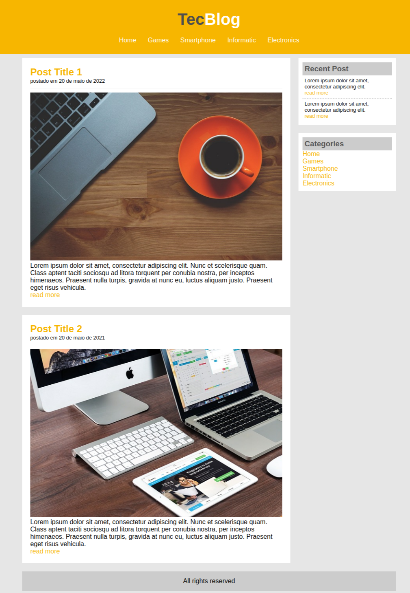

## Projeto
### Descrição 
Criando um blog de notícia de tecnologia chamada TecBlog utilizando somente HTML5 e CSS3 básicos mais elaborados. Foi uma proposta de projeto[#3] realizada através do curso Desenvolvimento Web completo da Udemy.

Link para visualizar o site: [Clique aqui](https://ideilsoncisne.github.io/ProjectTecBlog/)

### Tela
